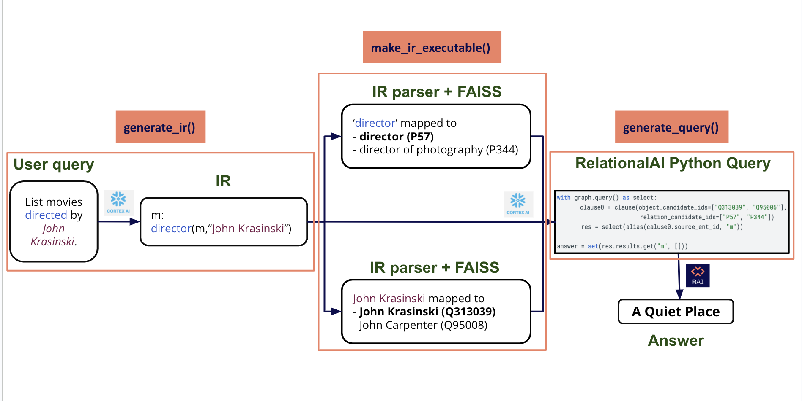

# KGQA: Question Answering on Knowledge Graphs Using RelationalAI and Snowflake Cortex AI

[Here]('https://github.com/jlscheerer/kgqa/tree/main') is the link to the original implementation from the paper [QirK: Question Answering via Intermediate Representation on Knowledge Graphs]('https://arxiv.org/abs/2408.07494'). 

<!-- ------------------------ -->

## Overview 
Duration: 1

Knowledge graphs are a useful structure to use to encode information about a particular domain. They allow for explicit inspection of the data encoded and the ability to reason over the relations. However, writing a query against a knowledge graph can be more challenging than other systems given that they generally lack a natural language interface. In order to query over a knowledge graph such as the one created by Wikidata, the user must know the specialized syntax of SPARQL as well as the knowledge graph representation of the entities and relations. For example, the concept of a hospital in wikidata is represented internally as Q16917.

In this quickstart, we will create a Snowflake service using Snowpark Container Services ( SPCS ), Snowflake's LLM service provided by their Cortex product and RelationalAI, a Knowledge Graph Coprocessor embedded inside of Snowflake, to allow a user to ask the following questions on a subset of Wikidata:

- List movies directed by John Krasinski?
- Name a movie directed by Quentin Tarantino or Martin Scorsese that has De Niro as a cast member
- Which movie's director was born in the same city as one of the cast members?


### What Is RelationalAI?

RelationalAI is a cloud-native platform that enables organizations to streamline and enhance decisions with intelligence. RelationalAI extends Snowflake with native support for an expanding set of AI workloads (e.g., graph analytics, rule-based reasoning, and optimization), all within your Snowflake account, offering the same ease of use, scalability, security, and governance.

Users can build a knowledge graph using Python and materialize it on top of their Snowflake data, which are shared with the RelationalAI app through Snowflake Streams. Insights can be written to Snowflake tables and shared across the organization.

### What You’ll Learn

- Loading data from Snowflake into RelationalAI Model
- Interact with Snowflake Container Service using User-defined Functions
- Utilize RelationalAI Python Library to execute Queires

### To reproduce the setup using your own data, you'll learn :

- Create a docker image and host it on Snowflake Container Service

### What You’ll Need
- A [Snowflake](https://www.snowflake.com/) Account
- An IDE (such as [Visual Studio Code](https://code.visualstudio.com/))
- A [Snowflake account](https://trial.snowflake.com/) with `ACCOUNTADMIN` and `KGQA_PUBLIC` access
    - Role "kgqa_public" in their snowflake account, which has ownership and usage access similar to "accountadmin". Follows ths steps mentioned [here](https://docs.snowflake.com/en/user-guide/security-access-control-configure#create-a-role) to create a new role. 
- Basic knowledge of using a Snowflake SQL Worksheet and Jupyter Notebook
- [Snowflake privileges on your user to install a Native Application](https://other-docs.snowflake.com/en/native-apps/consumer-installing#set-up-required-privileges)
- The [RAI KGQA Jupyter notebook](../kgqa_demo_setup/kgqa_demo_nb/kgqa_demo.ipynb) used in this quickstart 
- [Docker Setup](https://docs.docker.com/desktop/install/mac-install/)


### What You’ll Build
- A Question Answering System on Knowledge Graphs using RelationalAI and Snowflake Cortex AI


<!-- ------------------------ -->

## Architecture Diagram


Users may already have  their data in Snowflake. RelationalAI runs within the user's Snowflake account, creating a graph index over the Snowflake tables.  This allows a user to create a RelationalAI model in python. This model can be interpreted as an executable Knowledge Graph. When a user asks a natural language question, the system generates a RelationalAI Python query that is then executed and retrieves the relevant answers to the user. Our system is hosted on a Snowpark Container, and uses  Snowflake’s Cortex AI.  In summary, our solution leverages data in Snowflake tables, CortexAI to translate natural language to queries, and RelationalAI’s Native App to construct  an executable Knowledge graph that answers  these queries.

 
<!-- ------------------------ -->

## Example Walkthrough



- The end-to-end pipeline begins with a natural language question set by the end user. For instance, consider the question: “List the movies directed by John Krasinski.” The goal is to answer this question by using the information in the Wikidata Knowledge Graph. 
- Our system transforms the question into a structured language called Intermediate Representation ( IR ).  The IR identifies and represents the relevant entities and their relationships. We use Snowflake Cortex AI to generate the Intermediate Representation. IR’s syntax resembles first order logic: the natural language question will be translated to  (m such that John Krasinski is the director of m ) : “m : director(m, ‘John Krasinski’)”. Note, this presumes there exists an entry in our dataset that contains all of the directors by name. We resolve this in the next step.
- IR represents the keywords in the framed question logically. Here the keywords are “director” and “John krasinski”. We use similarity search ( Facebook AI Similarity - FAISS ) to match these keywords to their closest equivalent  entities and relationships in the underlying Wikidata Knowledge Graph. 
    - In this example, we retrieve the top two most similar results for each keyword. 
    - For each match, there is a corresponding ID, which is the Wikidata ID assigned to each property and entity.
    - So here - “director” is mapped to [ “director” (P57) and “director of photography” (P344)]
    - “John Krasinski” is mapped to [“John Krasinski” (Q313039) and “John Carpenter” (Q95008) ]
    - Note that we began with a natural language question, and the system was able to map it to the corresponding Wikidata IDs on its own.
- The natural language question, Intermediate Representation, and similarity search results are then fed as input to Snowflake Cortex AI which outputs the RelationalAI Python query. 
- This query is then directly executed on RelationalAI’s Model and the result is returned to the user. Note that everything runs securely in the user’s  Snowflake account on snowpark container services. Given that at the end we are executing a query on a Knowledge Graph, the answer is guaranteed to exist in our dataset, otherwise nothing will be returned.


<!-- ------------------------ -->

## Demo Setup

Follow the below steps to launch End-to-End Demo Setup.


> **_NOTE:_** User's Role permissions 
> Users should have access to role "kgqa_public" in their snowflake account, which has ownership and usage access similar to "accountadmin". Follows ths steps mentioned [here](https://docs.snowflake.com/en/user-guide/security-access-control-configure#create-a-role) to create a new role. 
 
### SETTING THE ENVIRONMENT VARIABLES

**<your_project_repository> is the path to the local directory where <git_repo> has been cloned.**


```sh
export SETUP_PATH="<your_project_directory>/kgqa_demo_setup/kgqa_setup"
```


#### STEP 1 : Navigate to the KGQA_SETUP FOLDER
```sh
cd $SETUP_PATH
```

#### STEP 2 : Populate all Snowflake config parameters 

- Update the config parameters in the config file ['config.json'](../kgqa_demo_setup/kgqa_setup/config.json)
> **_NOTE:_** Anything prefixed with **temp_** can be customized by the user, along with **account and sf_login_email**. *Everything else should remain unchanged*.

#### STEP 3 : Initializing database in Snowflake - *Copy Paste Output to SF Worksheet and Run*

*Execute the below **sf_db_initialization** script to produce SQL File to load and populate the Database and Tables in Snowflake ( copy-paste on Snowflake SQL Worksheet and Run)*

```sh
python3 $SETUP_PATH/setup.py --config $SETUP_PATH/config.json --output_dir $SETUP_PATH/ sf_db_initialization
```

> **_NOTE:_** To execute SQL commands in Snowflake Worksheet, you first need to select a database. Initially, this could be any database. Later in the script, you will create a custom database and switch to it for subsequent commands.

#### STEP 4 : Image Repository Creation - *Copy Paste Output to SF Worksheet and Run*

An Image Repository in Snowflake is a storage location where you can store and manage container images. These images are like snapshots of applications and their environments, which can be run on Snowflake's platform.

*Execute the below **create_image_repo** script to produce SQL File to create Image Repository on Snowflake ( copy-paste on Snowflake SQL Worksheet and Run)*

```sh
python3 $SETUP_PATH/setup.py --config $SETUP_PATH/config.json --output_dir $SETUP_PATH/ create_image_repo
```

#### STEP 5 : Push Image to Snowflake Image Repository

*Execute the below **build_push_docker_image** script to push docker image to Snowflake's Image Repository.*

```sh
python3 $SETUP_PATH/setup.py --config $SETUP_PATH/config.json --output_dir $SETUP_PATH/ build_push_docker_image --option push_only=True
```

- push_only parameter ensures that we don't re-execute the docker commands to build a new image. We download the existing pre-built image, and push it to our Snowflake Image Repository defined in the previous step. 


#### STEP 6 : Launch a Snowflake service - *Copy Paste Output to SF Worksheet and Run*

*Execute the below **create_service** script to produce SQL File to create Snowflake Service ( copy-paste on Snowflake SQL Worksheet and RUN)*

```sh
python3 $SETUP_PATH/setup.py --config $SETUP_PATH/config.json --output_dir $SETUP_PATH/ create_service
```
> **_NOTE:_** After running the "*CREATE SERVICE ..*" command in SF Worksheet, wait for the service to get **Status="READY"** ( takes around 3-4 minutes ) before creating the UDFs and testing them in the below Worksheet. 


Now, we are all set to run the Demo notebook!

<!-- ------------------------ -->


## Demo Notebook 

- Run the ['Notebook'](../kgqa_demo_setup/kgqa_demo_nb/kgqa_demo.ipynb) to play with our pipeline

> **_NOTE:_** After running the 1st cell, you will be prompted to enter your Snowflake account password. Please check the top-center of the screen to enter the password. 

<!-- ------------------------ -->

## Troubleshooting

In case you encounter any of the following issues, please follow the recommended steps:

1. **Server Overload Error**
   If the Snowflake server becomes unresponsive and shows a 'Server overloaded' error:
   - To resolve the issue, run [Step 6](#step-6--launch-a-snowflake-service---copy-paste-output-to-sf-worksheet-and-run) from Line that says *"DROP SERVICE IF EXISTS <service_name_defined_in_config>;"*


2. **Model Unavailable Error**
    The default models during development are lama3.1-70b for Snowflake Complete Task and e5-base-v2 for Snowflake Text Embedding Task. In case these models are not ['available in the region'](https://docs.snowflake.com/en/user-guide/snowflake-cortex/llm-functions#availability), go to the script generated [Step 6](#step-6--launch-a-snowflake-service---copy-paste-output-to-sf-worksheet-and-run) and run from Line that says   *"-- test the UDFs with sample inputs"*  with chosen model name in your region.

    **2.1** IF the text embedding model is changed from e5-base-v2 to something else, follow the **Steps [5-7]** under heading [Launch a SF Service on Custom Database](#launch-a-sf-service-on-a-custom-database). **Remember to  Switch to *kgqa_docker* folder to follow them !**

<!-- ------------------------ -->


## Launch a SF Service on a Custom Database

Follow the below steps to launch End-to-End pipeline as a Service on Snowflake and interact with it.


### SETTING THE ENVIRONMENT VARIABLES

**<your_project_repository> is the path to the local directory where <git_repo> has been cloned.**


```sh
export SETUP_PATH="<your_project_directory>/kgqa_demo_setup/kgqa_setup"
```


### STEP 1 : Navigate to the KGQA_DOCKER FOLDER
```sh
cd <your_project_directory>/kgqa_docker/
```

### STEP 2 : Populate all SF config parameters

- Update the config parameters in the config file ['config.json'](../kgqa_demo_setup/kgqa_setup/config.json)

> **_NOTE:_** Anything prefixed with **temp_** can be customized by the user, along with **account and sf_login_email**. *Everything else should remain unchanged*.

### STEP 3 : Initializing database in Snowflake - *Copy Paste Output to SF Worksheet and Run*

*Execute the below **sf_db_initialization** script to produce SQL File to load and populate the Database and Tables in Snowflake ( copy-paste on Snowflake SQL Worksheet and Run)*

> **_NOTE:_** To execute SQL commands in Snowflake Worksheet, you first need to select a database. Initially, this could be any database. Later in the script, you will create a custom database and switch to it for subsequent commands.

```sh
python3 $SETUP_PATH/setup.py --config $SETUP_PATH/config.json --output_dir $SETUP_PATH/ sf_db_initialization
```

### STEP 4 : Image Repository Creation - *Copy Paste Output to SF Worksheet and Run*

An Image Repository in Snowflake is a storage location where you can store and manage container images. These images are like snapshots of applications and their environments, which can be run on Snowflake's platform.

*Execute the below **create_image_repo** script to produce SQL File to create Image Repository on Snowflake ( copy-paste on Snowflake SQL Worksheet and Run)*

```sh
python3 $SETUP_PATH/setup.py --config $SETUP_PATH/config.json --output_dir $SETUP_PATH/ create_image_repo
```


### STEP 5 : Generate FAISS Index Files

The Similarity Search using FAISS relies on index files to find the best matching results. These index files must be included in the container image for the search to function properly.

*Execute the below **generate_embeddings** script to create the index files*

```sh
python3 $SETUP_PATH/setup.py --config $SETUP_PATH/config.json --output_dir $SETUP_PATH/ generate_embeddings --option model="e5-base-v2"
```

### STEP 6 : Push Image to Snowflake Image Repository

*Execute the below **build_push_docker_image** script to push docker image to Snowflake's Image Repository.*

```sh
python3 $SETUP_PATH/setup.py --config $SETUP_PATH/config.json --output_dir $SETUP_PATH/ build_push_docker_image
```


### STEP 7 : Launch a Snowflake service - *Copy Paste Output to SF Worksheet and Run*

*Execute the below **create_service** script to produce SQL File to create Snowflake Service ( copy-paste on Snowflake SQL Worksheet and RUN)*

```sh
python3 $SETUP_PATH/setup.py --config $SETUP_PATH/config.json --output_dir $SETUP_PATH/ create_service
```

> **_NOTE:_** After running the "*CREATE SERVICE ..*" command in SF Worksheet, wait for the service to get **Status="READY"** ( takes around 3-4 minutes ) before creating the UDFs and testing them in the below Worksheet.


<!-- ------------------------ -->


## Conclusion & Resources
Duration: 1

Congratulations on completing the our Question and Answering on Knowledge Graphs using RelationalAI and Snowflake guide! In this Quickstart you learned

- How to install the RelationalAI Native App from the Snowflake Marketplace
- How to build a knowledge graph on top of your Snowflake data without having to export your data from Snowflake
- How to run utilize data in your knowledge graph to answer Natural Language Questions

### Resources
- To learn about more about RelationalAI and view full documentation, visit [https://relational.ai](https://relational.ai)
- [Snowflake Marketplace](https://app.snowflake.com/marketplace)
- More info on [Snowflake Native Apps](https://docs.snowflake.com/en/developer-guide/native-apps/native-apps-about)author: Steve Bertolani
id: <qirk_id>
summary: This guide shows how to use RelationalAI and Snowflake to create a social graph and detect customer communities from retail transaction data.
categories: data-science, relationalai
environments: web
status: Published 
feedback link: https://github.com/RelationalAI/rai-samples/issues
tags: Getting Started, Data Science, Data Engineering, Twitter 

<!-- ------------------------ -->

### APPENDIX

#### A : Extra Commands for Docker - 

--  To see all images 
```sh 
docker images 
```

-- To drop an image using image_id ( the *docker images* command will give the image ID )
```sh 
docker rmi -f <image_id>
```

-- To drop an image using repository name ( the *docker images* command will give the Repository Name )
```sh 
docker rmi <repo_name>
```

-- Login to the container and run through container terminal 

```sh
docker run --platform linux/amd64 -p 8000:8000 <account_name>.registry.snowflakecomputing.com/<db_name>/<schema_name>/<image_repo_name>/<image_name> 
```

-- Login to the container and Run from inside the container 
```sh
docker run -it <account_name>.registry.snowflakecomputing.com/<db_name>/<schema_name>/<image_repo_name>/<image_name> /bin/bash 
```


#### B : SQL Commands to delete Snowflake Objects

```sh
-- delete a compute pool from Snowflake
drop compute pool <cp_name>;

-- delete warehouse
drop warehouse <wh_name>;

-- delete database
drop database <db_name>;

--delete service
drop service <service_name>

-- list all compute pools
drop compute pool <cp_name>
```

